# 🚀 Predictive E-Commerce Intelligence Analytics

An end-to-end **Data Analytics & Machine Learning project** that converts raw e-commerce marketplace data into meaningful business insights using analytics, predictive modeling, customer segmentation, 3D visual intelligence, and an interactive dashboard.

---

# 📌 Project Overview

Modern e-commerce platforms generate large volumes of transactional data across customers, sellers, products, payments, reviews, and logistics.

This project analyzes marketplace performance to discover:

- Revenue growth patterns
- Customer purchasing behavior
- Seller performance
- Product category insights
- Geographic market opportunities
- Future revenue forecasting

---

# 🛠️ Tech Stack

- Python
- Pandas
- NumPy
- Matplotlib
- Seaborn
- Plotly
- Scikit-Learn
- Dash
- Flask
- Git & GitHub

---

# 🏗️ Analytics Workflow

```
Raw E-Commerce Data
        |
        ↓
Data Cleaning & Processing
        |
        ↓
Feature Engineering
        |
        ↓
Exploratory Data Analysis
        |
        ↓
3D Business Intelligence
        |
        ↓
Machine Learning Models
        |
        ↓
Interactive Dash Dashboard
```

---

# 📊 Interactive Dashboard

A professional analytics dashboard was created using Dash for monitoring marketplace KPIs.

## Dashboard Capabilities

✔ Revenue Monitoring  
✔ Customer Analytics  
✔ Seller Insights  
✔ Product Intelligence  
✔ Geographic Performance  
✔ Business KPI Tracking  


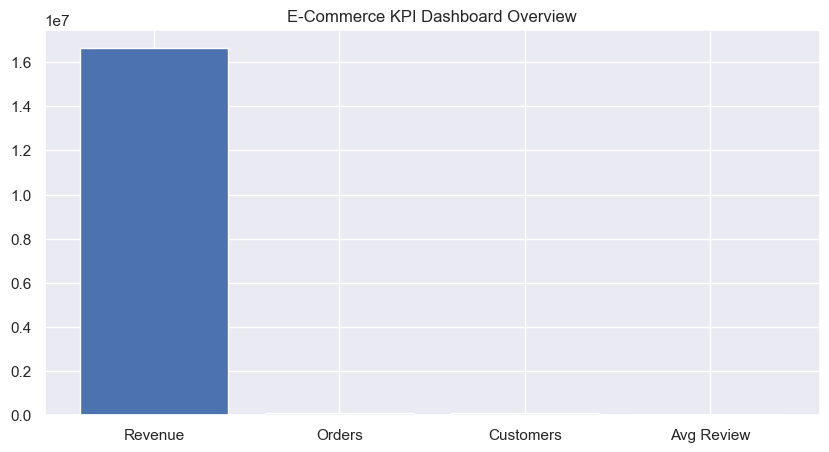


---

# 📈 Exploratory Data Analysis


## 📅 Monthly Revenue Trend

Analyzed marketplace revenue movement over time.

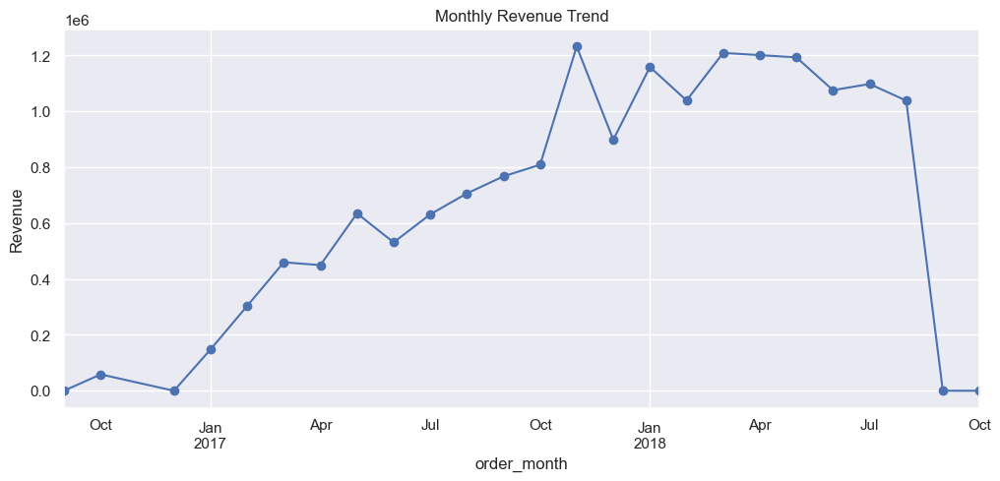


---


## 🛒 Top Product Categories

Identified highest revenue generating categories.

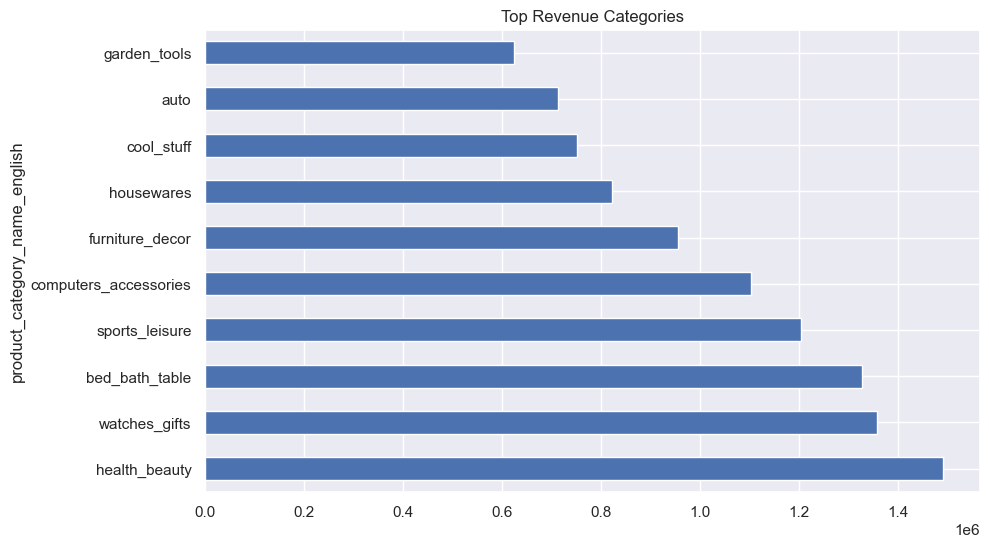


---


## ⭐ Customer Satisfaction vs Delivery

Studied impact of delivery performance on reviews.

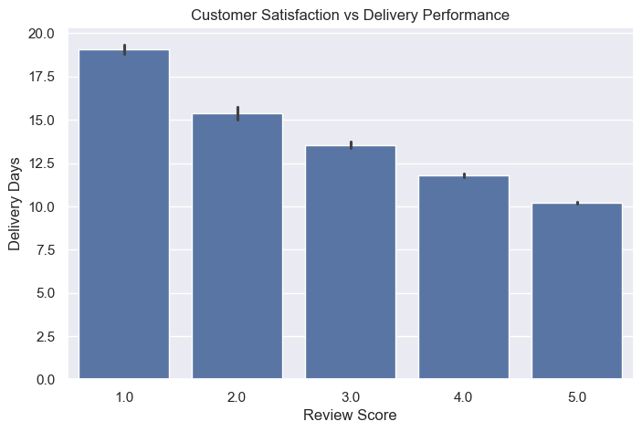


---


## ⭐ Review Distribution

Analyzed customer rating patterns.

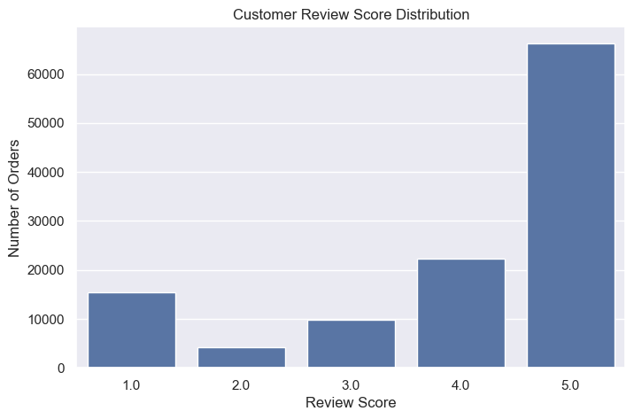


---


## 🔥 Feature Correlation Analysis

Understanding relationship between pricing, logistics, and reviews.

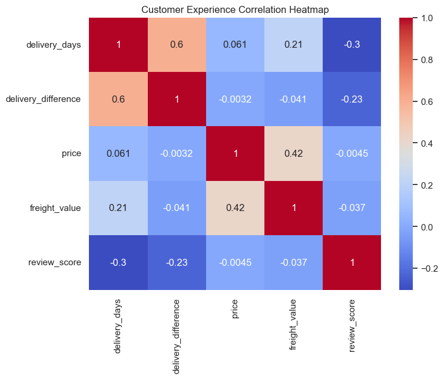


---

# 🧠 3D Business Intelligence Analytics


## 🚀 3D Category Intelligence Matrix

Multi-dimensional category evaluation using:

- Revenue
- Orders
- Customer Ratings

Helps identify premium performing product segments.


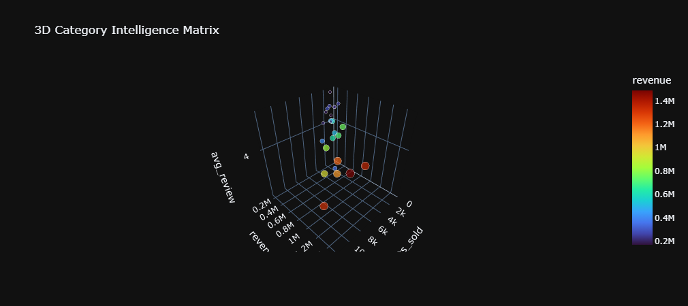


---


## 👥 3D Customer Value Intelligence

Customer segmentation based on:

- Total Spending
- Purchase Frequency
- Engagement


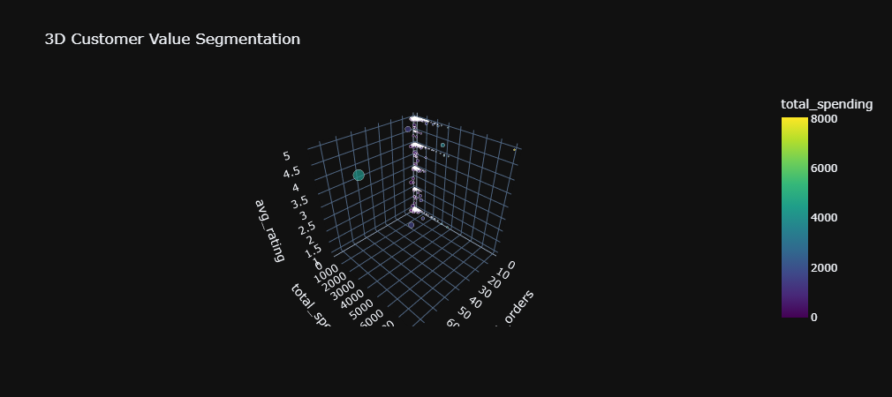


---


## 🏪 3D Seller Intelligence

Seller performance comparison using:

- Revenue Contribution
- Orders Processed
- Customer Satisfaction


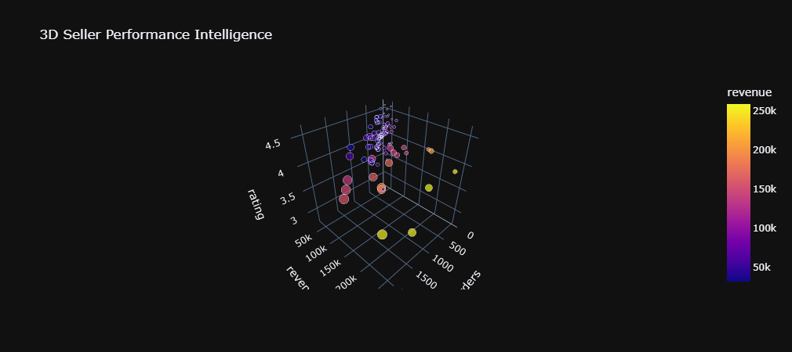


---


## 🌎 Geographic Intelligence

Regional marketplace analysis based on:

- State Revenue
- Order Volume
- Customer Metrics


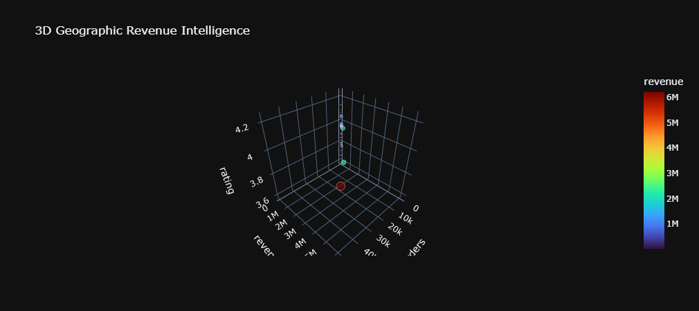


---

# 🏪 Seller Analytics


## Seller Performance Analysis

Identified marketplace seller contribution and efficiency.


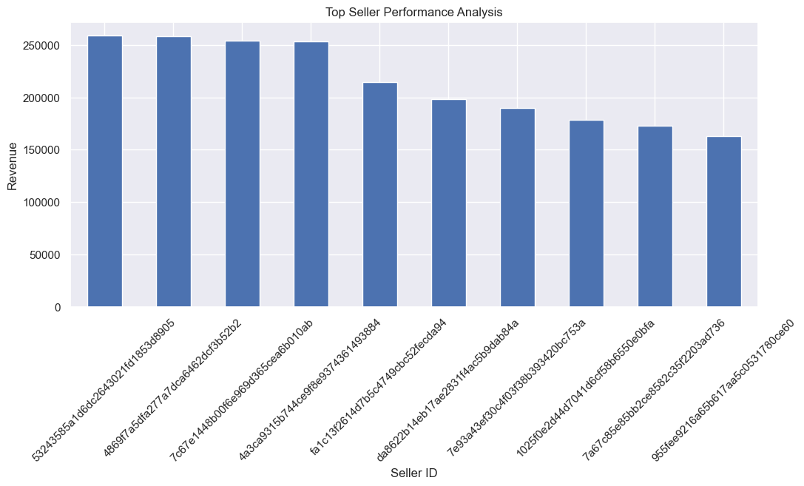


---


## Seller Revenue Concentration

Understanding dependency on top-performing sellers.


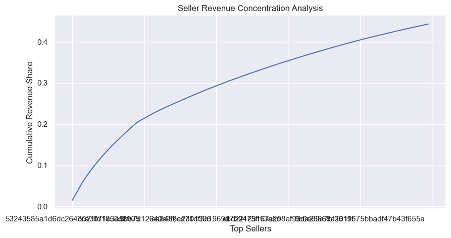


---

# 🌎 Geographic Analytics


## State Revenue Distribution


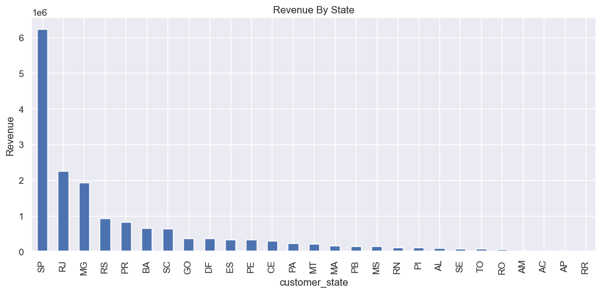


---


## State Order Distribution


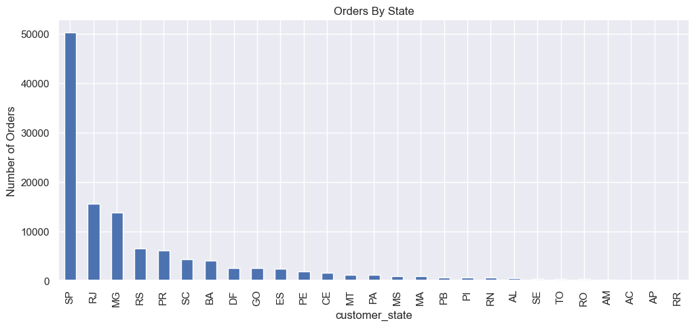


---

# 🤖 Machine Learning Models


## 📈 Revenue Forecasting

Implemented Linear Regression model to predict future marketplace revenue.

Model:

- Algorithm: Linear Regression
- Target: Revenue
- Feature: Time Trend


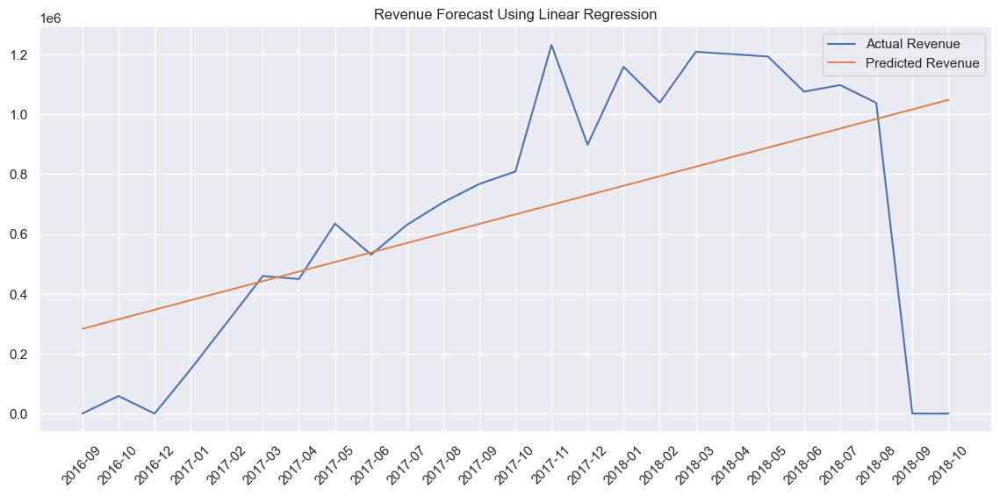


---


## 👥 Customer Segmentation

Implemented K-Means clustering to classify customers.

Customer Groups:

- Premium Customers
- Regular Buyers
- Low Engagement Customers


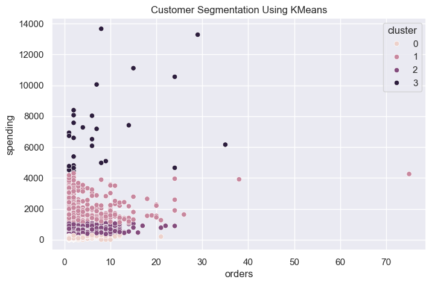


---

# 💡 Key Business Insights


### Customer Insights

- Faster delivery improves customer satisfaction.
- Review analytics highlight customer experience gaps.


### Product Insights

- Few categories dominate marketplace revenue.
- Category intelligence helps optimize business focus.


### Seller Insights

- High-performing sellers drive marketplace growth.
- Seller monitoring improves service quality.


### Revenue Insights

- Historical trends help predict future performance.
- ML models enable data-driven decisions.


---

# 📂 Project Structure


```
Predictive-Ecommerce-Intelligence-Analytics

│
├── dashboard
│   └── app.py
│
├── data
│   ├── ecommerce_cleaned_data.csv
│   └── raw datasets
│
├── images
│   ├── EDA Visualizations
│   ├── 3D Intelligence Analytics
│   └── Dashboard Images
│
├── Predictive E-Commerce Intelligence Analysis.ipynb
│
├── requirements.txt
│
└── README.md
```

---

# 🚀 How To Run Dashboard


Install dependencies:

```bash
pip install -r requirements.txt
```


Run dashboard:

```bash
cd dashboard

python app.py
```


Open:

```
http://127.0.0.1:8050/
```


---

# ⭐ Project Highlights

✔ End-to-End Data Analytics Pipeline  
✔ 100k+ Marketplace Transactions  
✔ Interactive Dash Dashboard  
✔ Advanced 3D Business Intelligence  
✔ Revenue Forecasting Model  
✔ Customer Segmentation Using Machine Learning  
✔ Real-World Business Analytics Workflow  


---

# 👨‍💻 Author

**Divyam Gupta**
