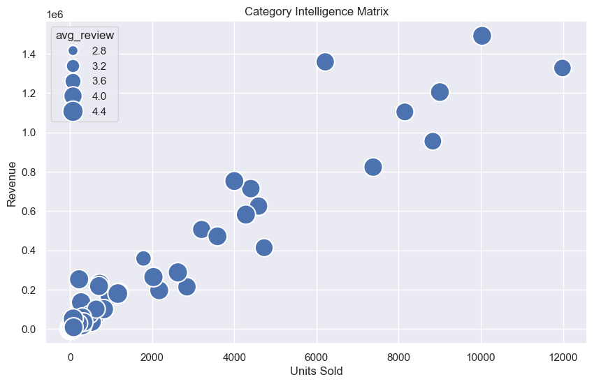
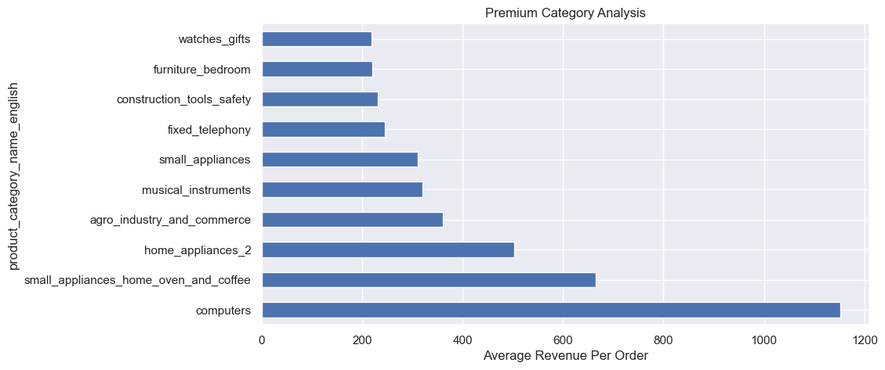

# 🚀 Predictive E-Commerce Intelligence Analytics

An end-to-end **Business Analytics and Machine Learning project** built on real-world e-commerce transactional data to analyze customer behavior, product performance, seller efficiency, geographical trends, and revenue forecasting.

The project combines:

- Data Engineering
- Exploratory Data Analysis
- Business Intelligence
- Machine Learning
- Interactive Dash Dashboard

---

## 📌 Project Overview

Modern e-commerce platforms generate millions of transactions involving customers, sellers, products, payments, and reviews.

This project builds a complete analytical pipeline to transform raw marketplace data into actionable business intelligence.

Key objectives:

- Understand customer satisfaction drivers
- Identify high-performing product categories
- Analyze seller marketplace performance
- Discover geographical revenue patterns
- Forecast future revenue trends
- Segment customers using Machine Learning

---

# 🏗️ Project Architecture


Raw Olist Dataset
        |
        ↓
Data Cleaning & Preprocessing
        |
        ↓
Feature Engineering
        |
        ↓
Business Analytics
        |
        ↓
Machine Learning Models
        |
        ↓
Interactive Dash Dashboard


---

# 🛠️ Tech Stack

### Programming
- Python

### Data Processing
- Pandas
- NumPy

### Visualization
- Matplotlib
- Seaborn
- Plotly

### Machine Learning
- Scikit-Learn

### Dashboard
- Dash
- Flask

### Tools
- Jupyter Notebook
- VS Code
- Git & GitHub


---

# 📊 Interactive Analytics Dashboard

A professional Dash dashboard was developed to track important business KPIs.

## Dashboard Features

✔ Total Revenue Tracking  
✔ Total Orders Analysis  
✔ Customer Base Monitoring  
✔ Customer Rating Analysis  
✔ Category Revenue Insights  
✔ Seller Performance Tracking  


## Dashboard Preview


---

# 📈 Exploratory Data Analysis


## 1. Revenue Trend Analysis

Analyzed monthly revenue patterns to understand marketplace growth.


---

## 2. Product Category Intelligence

Identified the most valuable product segments contributing to revenue.


---

## 3. Customer Satisfaction Analytics

Studied the relationship between delivery performance and customer ratings.


---

## 4. Customer Review Distribution

Analyzed customer feedback patterns.


---

## 5. Customer Experience Correlation

Correlation study between:

- Delivery time
- Product price
- Freight cost
- Reviews


---

# 🛒 Product Intelligence


## Category Intelligence Matrix

Compared:

- Revenue generation
- Units sold
- Customer ratings





---

## Premium Category Analysis


Identified high-value categories with higher average order value.





---


# 🏪 Seller Intelligence


## Seller Performance Analysis

Analyzed top revenue-generating sellers.


---

## Seller Revenue Concentration


Studied marketplace dependency on top sellers.


---

# 🌎 Geographic Analytics


## Revenue by State


Identified strongest geographical markets.


---

## Order Distribution by State


---


# 🤖 Machine Learning


## Revenue Forecasting using Linear Regression

Built a predictive model to forecast future revenue trends.


Model:

- Algorithm: Linear Regression
- Feature: Time-based revenue trend
- Target: Future revenue


---


# 👥 Customer Segmentation


Used K-Means clustering to divide customers based on:

- Purchase frequency
- Spending behavior


Segments:

- High Value Customers
- Regular Customers
- Low Engagement Customers


---

# 📌 Key Business Insights


### Customer Insights

- Faster deliveries positively impact customer satisfaction.
- Review scores reveal customer experience quality.


### Product Insights

- Few product categories contribute major marketplace revenue.
- Premium categories generate higher order values.


### Seller Insights

- Marketplace revenue is concentrated among top-performing sellers.
- Seller performance impacts customer experience.


### Revenue Insights

- Historical trends can support future revenue forecasting.
- Seasonal patterns influence marketplace growth.


---

# 📂 Project Structure

```
Predictive-Ecommerce-Intelligence-Analytics
│
├── 📁 dashboard
│   │
│   └── app.py
│       └── Interactive Dash dashboard application
│
├── 📁 data
│   │
│   ├── ecommerce_cleaned_data.csv
│   │   └── Final processed dataset
│   │
│   └── olist datasets
│       └── Raw marketplace datasets
│
├── 📁 images
│   │
│   ├── Analysis Visualizations
│   │   ├── Revenue Trends
│   │   ├── Customer Analytics
│   │   ├── Seller Analytics
│   │   ├── Product Intelligence
│   │   └── Machine Learning Results
│   │
│   └── Dashboard Screenshots
│
├── 📓 Predictive E-Commerce Intelligence Analysis.ipynb
│   └── Data Cleaning, EDA and Machine Learning
│
├── 📄 requirements.txt
│   └── Project dependencies
│
└── 📄 README.md
    └── Project documentation
```


---

# 🚀 How to Run Dashboard


Install dependencies:

```bash
pip install -r requirements.txt