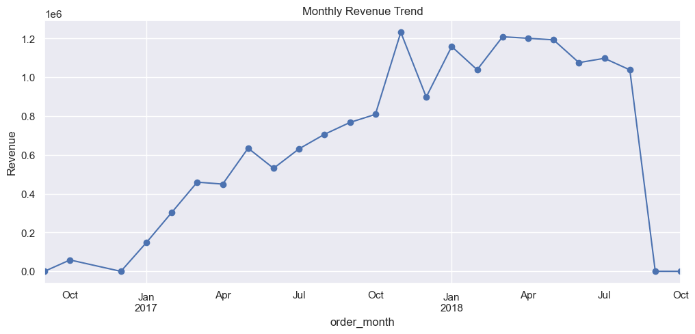
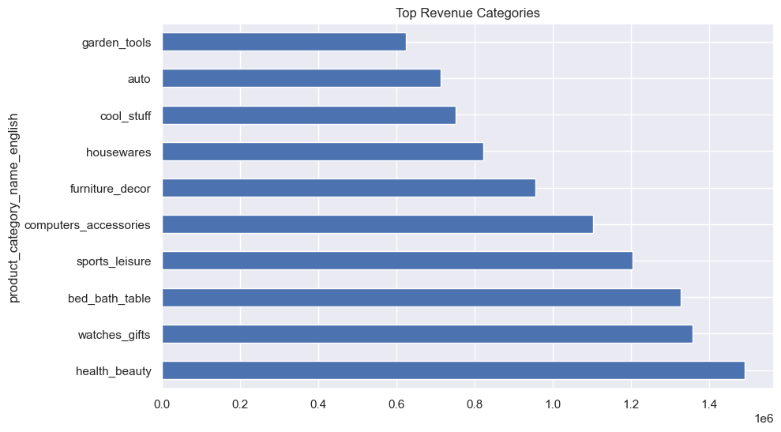
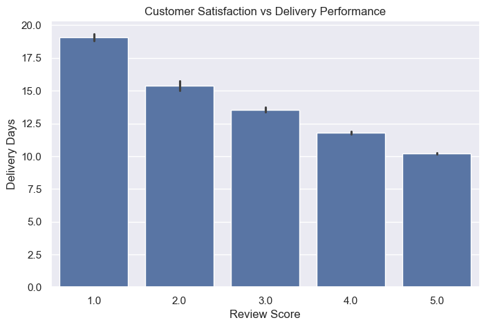
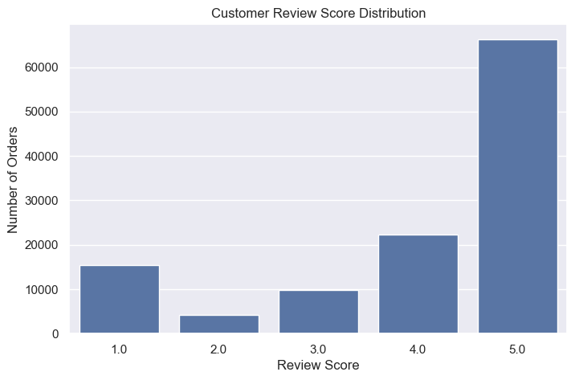
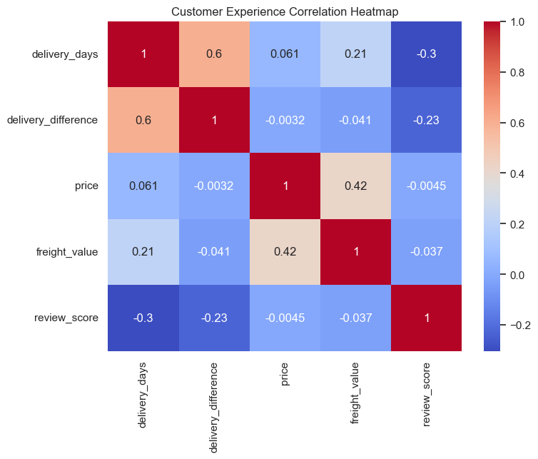
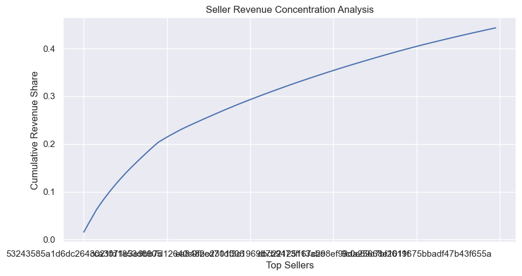
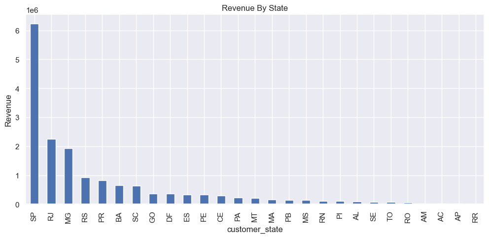
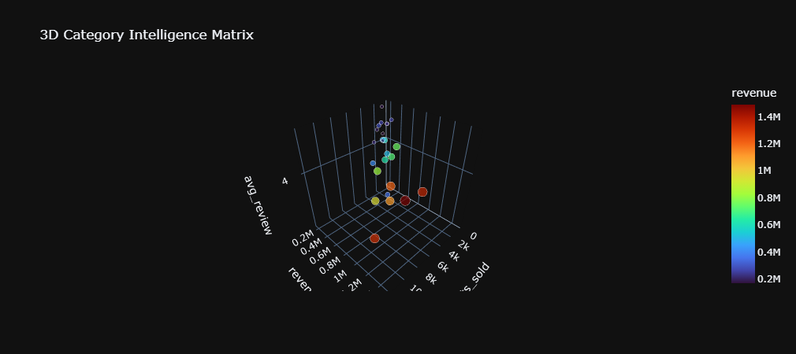
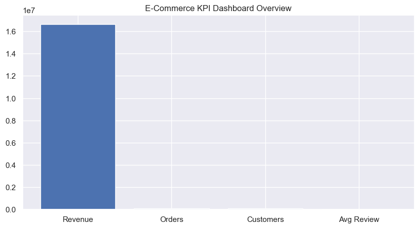

# Predictive E-Commerce Intelligence Analytics

End-to-end analytics pipeline on the Olist Brazilian marketplace dataset: nine raw
transactional tables joined into a validated fact table, exploratory analysis across
customers, sellers, categories and geography, three models, and an interactive Dash
dashboard.

**Headline finding:** customer satisfaction on this marketplace is a logistics
problem, not a pricing problem. Late deliveries produce a one-star review **52.5%**
of the time against **6.6%** for early deliveries, while order value correlates with
review score at **−0.04** — effectively zero.

---

## Data

[Olist Brazilian E-Commerce Public Dataset](https://www.kaggle.com/datasets/olistbr/brazilian-ecommerce)
— real anonymised transactions, September 2016 to August 2018. All values in
Brazilian Reais (R$).

| Table | Rows | Grain |
|---|---|---|
| `orders` | 99,441 | one order |
| `order_items` | 112,650 | one line item |
| `order_payments` | 103,886 | one payment instrument |
| `order_reviews` | 99,224 | one review |
| `customers` | 99,441 | one order's customer record |
| `products` | 32,951 | one product |
| `sellers` | 3,095 | one seller |
| `product_category_name_translation` | 71 | one category |

`customer_id` is order-scoped; the person is `customer_unique_id`. All customer-level
analysis uses the latter.

---

## Pipeline

```
9 raw CSVs
    │
    ├─ aggregate payments and reviews to ORDER grain      ← prevents join fan-out
    │
    ├─ build fact table at LINE-ITEM grain
    │     validate="many_to_one" on every merge + row-count assertion
    │
    ├─ feature engineering
    │     gmv / freight / line_total   (kept separate)
    │     delivery_days, delivery_gap, delivery_status
    │
    ├─ filter to delivered orders for all revenue reporting
    │
    ├─ EDA: revenue, categories, sellers, geography, satisfaction
    │
    ├─ Model 1  monthly revenue forecast (walk-forward validated)
    ├─ Model 2  RFM customer segmentation (scaled, k by silhouette)
    ├─ Model 3  1–2 star review classifier
    │
    └─ export pre-aggregated tables → Dash dashboard
```

---

## Headline metrics

Delivered orders only.

| Metric | Value |
|---|---|
| Gross merchandise value | R$13,221,498 |
| Freight collected | R$2,198,276 |
| Total transacted | R$15,419,774 |
| Delivered orders | 96,478 |
| Unique customers | 93,358 |
| Average order value | R$159.83 |
| Items per order | 1.14 |
| Average review score | 4.16 |
| 1–2 star rate | 12.7% |
| Repeat purchase rate | 3.0% |

GMV is gross transacted value, not net revenue. Freight is a cost pass-through
(14.3% of the total), and no COGS or commission data exists in this dataset.

---

## Exploratory analysis

### Revenue trend



### Category concentration

72 categories. The top 10 carry **62.4%** of revenue; health & beauty leads at
R$1.41M. Volume leaders and margin leaders differ — `computers` has the highest
average ticket at roughly R$1,150 per line on low volume.



### Delivery performance drives satisfaction

| Delivery status | Orders | Avg review | 1-star rate |
|---|---|---|---|
| Early | 88,644 | 4.29 | 6.6% |
| On Time | 1,292 | 4.03 | 8.4% |
| Late | 6,534 | **2.27** | **52.5%** |



Review scores are J-shaped — 56% five-star, 13% one-star, only 3.5% two-star.
People rate when delighted or furious. The mean is therefore a poor summary
statistic; the **1–2 star rate** is the metric to track.



### Correlations

| Pair | r |
|---|---|
| delivery days ↔ review score | **−0.334** |
| freight ↔ review score | −0.090 |
| order value ↔ review score | −0.042 |

Price does not drive satisfaction. Discounting will not buy ratings; logistics SLA
will.



### Seller concentration

2,970 sellers. **133 of them generate 50% of revenue**; the top 10% generate 66.3%.
That is a concentration risk worth naming account managers against.



### Geography

São Paulo is **37.4%** of revenue and the top three states are **62.5%** — but SP
has among the *lowest* average order values at R$142, while remote northern states
lead on basket size (PB R$267, AC R$245). Volume and value live in different states,
so "grow SP" and "grow order value" are two different strategies.



### Multi-dimensional category and seller views

Bubble charts — revenue against volume, with marker size encoding average review
score.



---

## Models

### 1. Monthly revenue forecast

The series is truncated to a clean window (2017-01 to 2018-08); the 2016 months are
a near-empty pilot and the tail is the dataset's collection cut-off, not a business
event. Validation is walk-forward, one step ahead, against a naive baseline.

| Model | MAE | MAPE |
|---|---|---|
| Naive (last value carried forward) | **R$57,626** | **5.4%** |
| Linear trend | R$178,412 | 17.3% |
| Trend + monthly seasonality | R$189,448 | 18.2% |

**The naive baseline wins by roughly 3×.** Revenue plateaued through 2018 while a
linear trend keeps climbing, so the trend model describes 2017 growth rather than
predicting anything. In-sample R² on the clean window is 0.823, which illustrates
why in-sample fit is not evidence of forecasting ability. A production version needs
SARIMA or Prophet with a 12-month seasonal term — or an acknowledgement that 20
monthly observations is thin for forecasting at all.

R² is deliberately not reported on the holdout: with six points its denominator is
unstable and the number would be meaningless.

### 2. Customer segmentation

Full RFM (recency, frequency, monetary), log-transformed spend, standard-scaled,
with k selected by silhouette rather than assumed.

| k | Silhouette |
|---|---|
| **2** | **0.685** |
| 3 | 0.354 |
| 4 | 0.365 |
| 5 | 0.352 |

Silhouette collapses after k=2 because **frequency is degenerate at a 3.0% repeat
rate** — 97% of customers bought exactly once, so there is almost nothing to cluster
on. The honest conclusion is that RFM is the wrong framework for this business. The
notebook includes a first-order value tier as the practical alternative, which is
actionable at acquisition rather than requiring a purchase history.

The 3% repeat rate is arguably the most important finding in the dataset: a
marketplace buying all its growth through acquisition is structurally fragile.

### 3. Low-review classifier

Predicts whether an order will receive a 1–2 star review, from delivery duration,
lateness, freight, order value, item count, state and category. This turns the
strongest descriptive finding into something an operations team can act on before
the review lands.

| Metric | Value |
|---|---|
| Positive class rate | 12.8% |
| ROC-AUC | 0.758 |
| PR-AUC | 0.458 (random baseline 0.128) |

Accuracy would be misleading here — always predicting "satisfied" scores 87%.

---

## Interactive dashboard

Dash application with state, category and date-range filters wired through
callbacks. Reads a 4 MB pre-aggregated table rather than the raw fact table.



---

## Methodology notes

This pipeline was rebuilt after a self-audit of the first version. The defects found
and the reasoning behind each fix are documented inline in the notebook, tagged
`[FIX n]`:

| Defect | Impact | Fix |
|---|---|---|
| `payments` and `reviews` joined one-to-many onto a line-item table | 6,493 duplicate rows; GMV inflated 5.05% | pre-aggregate both to order grain |
| No cardinality checks across seven merges | fan-out went undetected | `validate="many_to_one"` plus row-count assertions |
| `delivery_group()` returned `"Late"` for `NaN` | 3,421 cancelled and undelivered orders mislabelled | `pd.isna()` guard, separate `Not Delivered` bucket |
| No `order_status` filter | cancelled orders counted in revenue | revenue recognises on delivery |
| Average order value computed across line items | R$140.68 instead of R$159.83 | aggregate to order grain first |
| `price + freight` reported as revenue | freight is a cost pass-through | GMV, freight and total kept separate |
| Forecast never split or scored | model was unvalidated | clean window, walk-forward CV, naive baseline |
| K-Means unscaled with hardcoded k | spend variance dominated ~300:1; clusters were spend bins | RFM, log transform, scaling, silhouette-selected k |
| Null categories dropped silently | 1,627 rows invisible in category charts | explicit `unknown` bucket |
| Dashboard loaded a 68 MB raw CSV at import | slow start, no filtering possible | 4 MB pre-aggregated table, real callbacks |

---

## Known limitations

- **No cost data.** GMV is not profit. Without COGS, commission rates or return
  rates, "largest category" and "most profitable category" may be different answers.
- **Twenty monthly observations is thin for forecasting.** One seasonal cycle is not
  enough to fit seasonality reliably, which is why the naive baseline wins.
- **`olist_geolocation_dataset` is unused.** Real shipping distance is available and
  would likely be the strongest single feature in the review classifier.
- **Association, not causation.** Delivery duration is confounded with distance,
  seller and product type. Establishing causation requires stratification by route
  or an experiment on delivery-promise accuracy.
- **Review response bias.** The J-shaped score distribution is self-selected;
  the silent middle is not represented.

---

## Project structure

```
Predictive-Ecommerce-Intelligence-Analytics
│
├── Predictive E-Commerce Intelligence Analysis.ipynb   full pipeline, outputs included
│
├── dashboard/
│   └── app.py                                          Dash app with filter callbacks
│
├── dashboard_data/                                     generated by the notebook
│   ├── dash_fact.csv.gz
│   └── summary_*.csv
│
├── data/                                               raw Olist CSVs
├── images/                                             EDA and analysis figures
├── requirements.txt
└── README.md
```

---

## Running it

```bash
pip install -r requirements.txt
```

Run the notebook end to end first — its final cell writes the aggregated tables the
dashboard reads:

```bash
jupyter notebook "Predictive E-Commerce Intelligence Analysis.ipynb"
```

Then start the dashboard:

```bash
python dashboard/app.py
```

Open <http://127.0.0.1:8050/>

---

## Tech stack

Python · pandas · NumPy · scikit-learn · Matplotlib · Seaborn · Plotly · Dash

---

## Author

**Divyam Gupta** — [GitHub](https://github.com/divyam1604)
